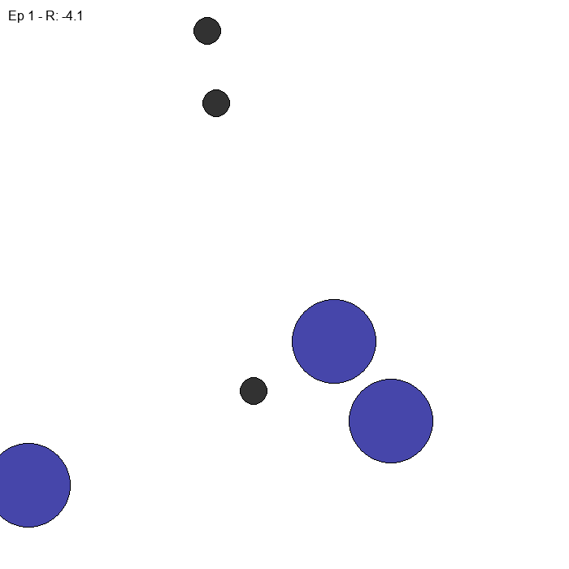
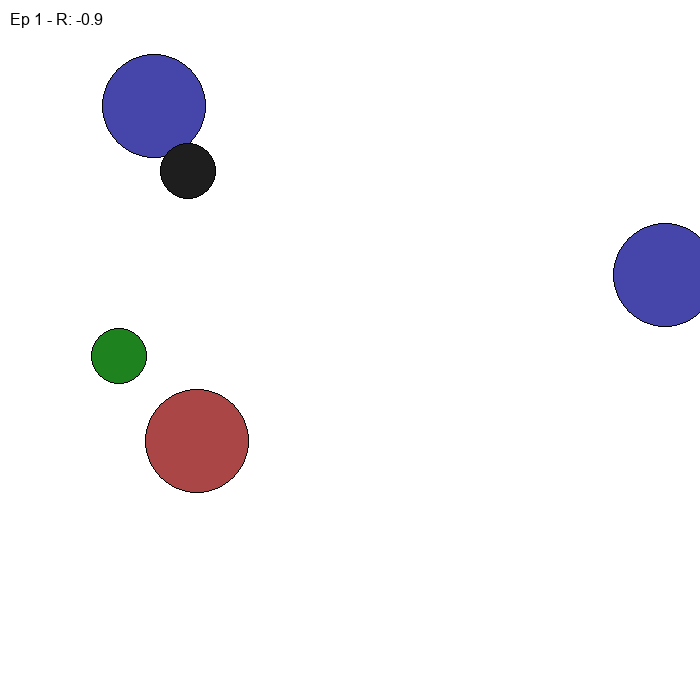
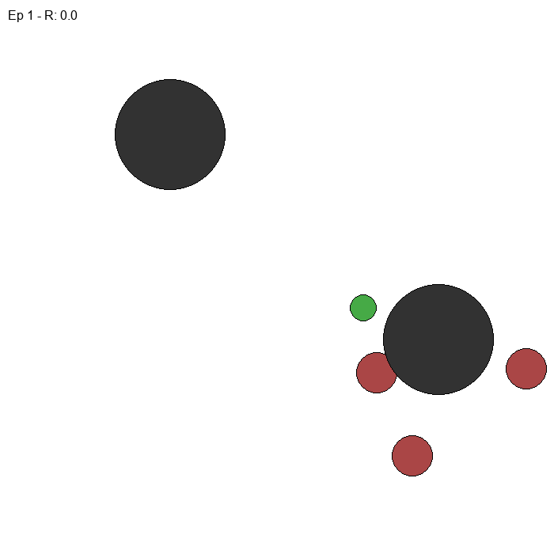
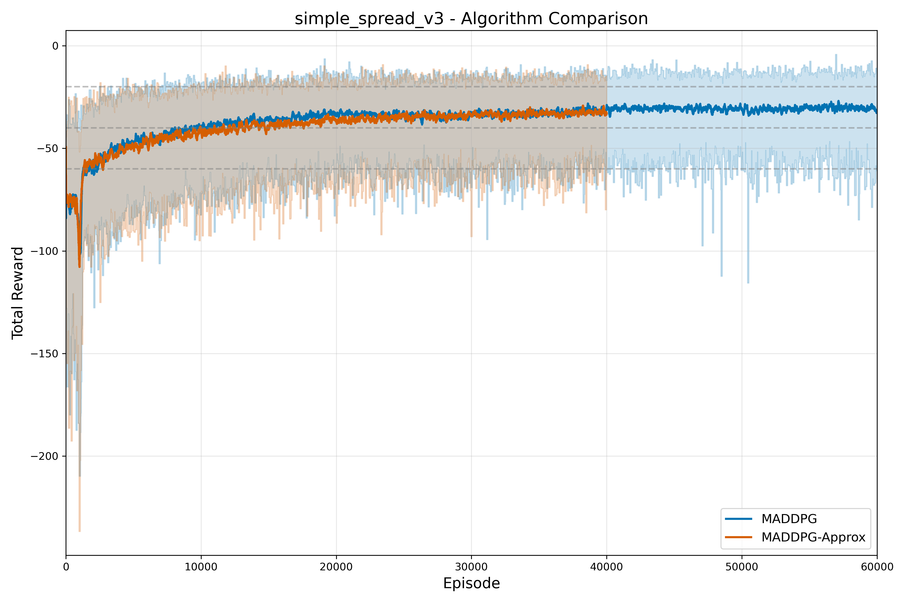
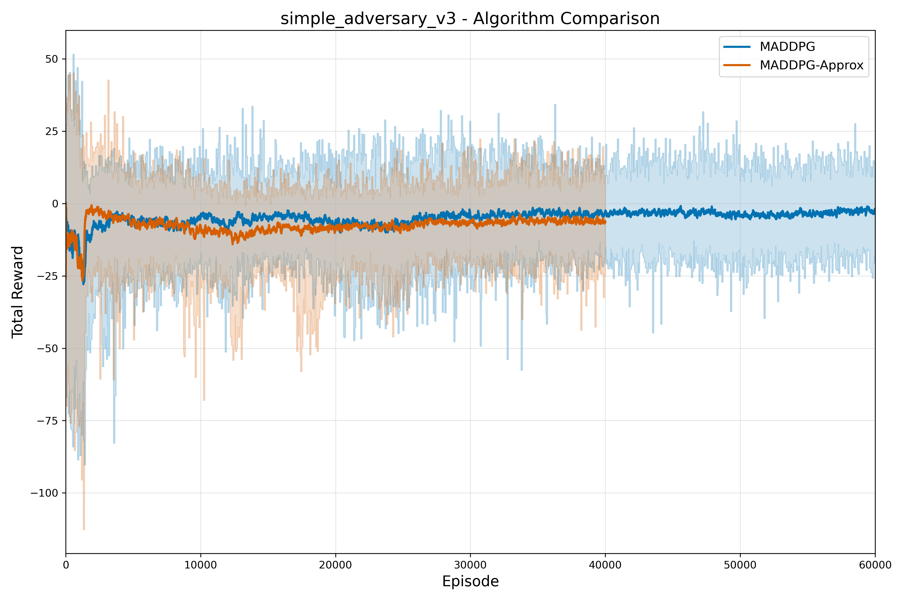
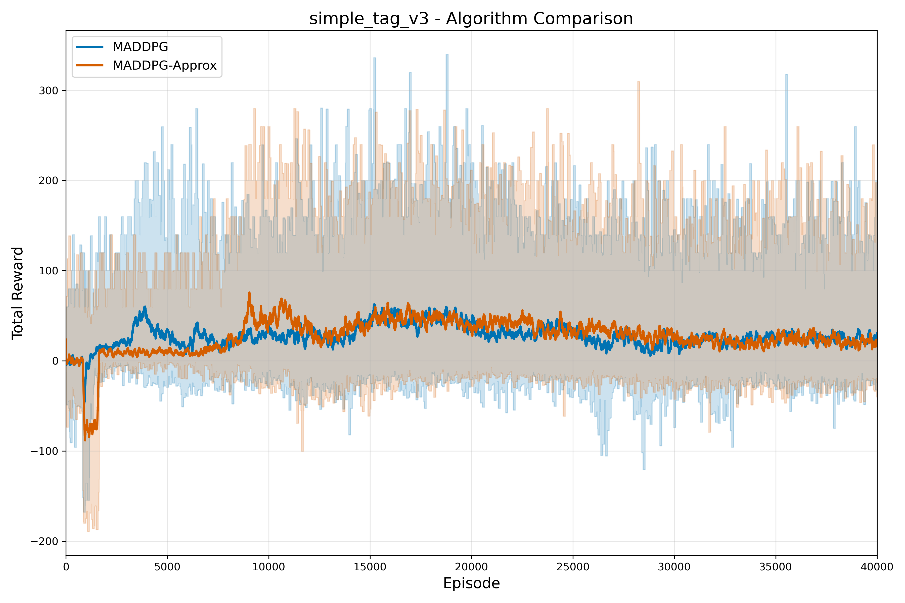

# maddpg-zoo-torch: Multi-Agent DDPG with PettingZoo & PyTorch

A PyTorch implementation of Multi-Agent Deep Deterministic Policy Gradient (MADDPG) and its approximation variant for cooperative-competitive environments. Built with PettingZoo's MPE environments and SuperSuit wrappers, this project supports both single and parallel training modes. The codebase features clean, modular design with comprehensive visualization tools and flexible environment handling.

## Environments in Action

<div align="center">
<table>
  <tr>
    <td><b>Cooperative Navigation<br>(simple_spread_v3)</b></td>
    <td><b>Physical Deception<br>(simple_adversary_v3)</b></td>
    <td><b>Predator-Prey<br>(simple_tag_v3)</b></td>
  </tr>
  <tr>
    <td></td>
    <td></td>
    <td></td>
  </tr>
</table>
</div>

## Overview

MADDPG is an extension of DDPG for multi-agent environments, where each agent has its own actor and critic networks. The key insight is that the critic for each agent uses the observations and actions of all agents, while the actor only uses its own observations.

### MADDPG-Approx Variant

This repository also includes the MADDPG-Approx variant, which was described in the original MADDPG paper but is less commonly implemented. In this approach, each agent learns approximate models of other agents' policies. Instead of requiring access to other agents' actions during training, each agent tries to infer what actions other agents might take based on their observations. This approach:

- Reduces the centralization requirements during training
- Tests whether agents can effectively learn to model other agents' behaviors
- Provides insights into multi-agent coordination with limited information

I implemented this variant to explore how well it performs compared to the standard MADDPG implementation and to better understand the trade-offs involved.

### Project Motivation

I created this project to implement MARL algorithms using modern environments and PyTorch. Finding that many existing implementations were outdated, I wanted to build my own test bed with clean, modular code that works with current libraries like PettingZoo. This repository serves as a foundation for experimenting with multi-agent reinforcement learning, with plans to implement more MARL algorithms in the future.

## Requirements

To install the required packages, run:

```bash
conda env create -f environment.yml
conda activate maddpg
```

## Project Structure

```
project_root/
├── maddpg/                  # Core algorithm package
│   ├── ddpg.py              # DDPG implementation
│   ├── maddpg.py            # MADDPG implementation
│   ├── maddpg_approx.py     # MADDPG-Approx implementation
│   └── networks.py          # Neural network architectures
├── utils/                   # Utilities
│   ├── env.py               # Environment utilities
│   ├── logger.py            # Logger / Tensorboard
│   └── plotting.py          # Visualization utilities
├── data/                    # Training data
│   ├── simple_spread_v3/    # Organized by environment
│   └── simple_adversary_v3/
├── outputs/                 # Generated outputs
│   ├── plots/               # Performance plots
│   └── gifs/                # Agent behavior GIFs
├── train.py                 # Single environment training
├── train_parallel_env.py    # Parallel environment training
├── run.py                   # Evaluation script / Gif Generation
├── plot.py                  # Plotting and comparison tools
└── LICENSE                  # MIT License
```

### Environment Implementation

The `utils/env.py` file contains comprehensive utilities for working with PettingZoo environments, including:

- Dynamic discovery and loading of all MPE environments
- Environment parallelization using SuperSuit wrappers
- Handling of observation and action space padding for consistent tensor shapes
- Flexible environment creation for both training and evaluation

This implementation provides a clean interface for working with multi-agent environments and simplifies the process of training with parallel environments.

## Training

To train the agents, run:

```bash
# Train with standard MADDPG
python train.py --env-name simple_spread_v3 --algo maddpg --episodes 10000 --batch-size 512 --gamma 0.95 --tau 0.01 --actor-lr 0.0005 --critic-lr 0.001 --noise-scale 0.3

# Train with MADDPG-Approx
python train.py --env-name simple_spread_v3 --algo maddpg_approx --episodes 10000 --batch-size 512 --gamma 0.95 --tau 0.01 --actor-lr 0.0005 --critic-lr 0.001 --noise-scale 0.3
```

For parallel training with multiple environments:

```bash
python train_parallel_env.py --env-name simple_spread_v3 --num-envs 4 --batch-size 512 --gamma 0.95 --tau 0.01 --actor-lr 0.0005 --critic-lr 0.001 --noise-scale 0.3
```

## Running Trained Agents

To run and visualize trained agents:

```bash
python run.py --model-path ./data/simple_spread_v3/maddpg/model.pt --env-name simple_spread_v3 --episodes 3 --create-gif
```

## Plotting Results

To plot and compare algorithm performance:

```bash
# Plot single algorithm results
python plot.py --mode single --env-name simple_spread_v3 --rewards-path ./data/simple_spread_v3/maddpg/agent_rewards.npy

# Compare algorithms
python plot.py --mode compare --env-name simple_spread_v3 --algo1-name MADDPG --algo1-path ./data/simple_spread_v3/maddpg/agent_rewards.npy --algo2-name MADDPG-Approx --algo2-path ./data/simple_spread_v3/maddpg_approx/agent_rewards.npy
```

## Supported Environments

This implementation supports all Multi-Agent Particle Environments (MPE) from PettingZoo, including:

- `simple_spread_v3`: Cooperative navigation
- `simple_adversary_v3`: Physical deception
- `simple_tag_v3`: Predator-prey
- `simple_world_comm_v3`: Communication with obstacles
- `simple_speaker_listener_v4`: Communication task

## Algorithm Comparison: MADDPG vs MADDPG-Approx

### Cooperative Navigation (simple_spread_v3)



### Physical Deception (simple_adversary_v3)



### Predator-Prey (simple_tag_v3)



### Performance Analysis

The MADDPG-Approx variant was an interesting experiment to see if agents could effectively learn by inferring other agents' policies rather than having direct access to them during training. Key findings:

- **Close Performance**: Surprisingly, MADDPG and MADDPG-Approx achieve remarkably similar results across different environments, showing that policy inference can be nearly as effective as direct action observation
- **Training Stability**: MADDPG-Approx showed slightly more variance during training compared to standard MADDPG
- **Inference Quality**: The approximate actor models became increasingly accurate as training progressed, eventually approaching the performance of the standard MADDPG

The performance difference varies by environment type:

- In cooperative tasks (simple_spread_v3), the two approaches achieve very close results, with standard MADDPG having only a slight edge
- In competitive scenarios like simple_adversary_v3 and simple_tag_v3, the gap is slightly bigger, but MADDPG-Approx still performs remarkably well considering it doesn't have direct access to other agents' actions

These results suggest that the approximation approach described in the original MADDPG paper is more powerful than commonly assumed, and could be a viable alternative in scenarios where centralized training with decentralized execution is difficult to implement.

## Conclusion

This project demonstrates the effectiveness of MADDPG in multi-agent reinforcement learning tasks and explores the MADDPG-Approx variant described in the original paper. The results suggest that while direct access to other agents' actions during training leads to better performance, agents can still learn effective policies through inference.

The implementation of environment utilities in `env.py` provides a flexible framework for working with PettingZoo environments and demonstrates how to effectively parallelize training using existing tools like SuperSuit.

## References

- [Multi-Agent Actor-Critic for Mixed Cooperative-Competitive Environments](https://arxiv.org/abs/1706.02275)
- [PettingZoo: Gym for Multi-Agent Reinforcement Learning](https://pettingzoo.farama.org/)
- [SuperSuit: Wrappers for RL Environments](https://github.com/Farama-Foundation/SuperSuit)

## License

This project is licensed under the [MIT License](LICENSE)
